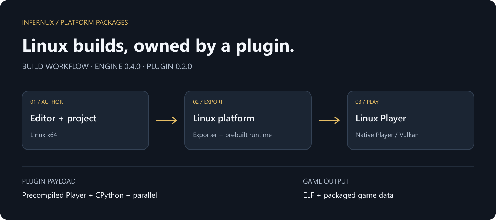

# Linux 平台

插件携带预编译 Linux Player、CPython 运行时和可选并行模块。普通导出只组装这些文件和项目 cook 内容，不需要引擎源码、CMake 或编译工具链。

## 构建前准备

Linux x64 的 Infernux 0.4.0（Python 3.13）。对应的预编译 Player 载荷由本插件提供。运行游戏需要可用的 Vulkan 驱动和引擎要求的平台库。

## 宿主边界

Linux 构建 Linux。此包不提供从 Windows 交叉编译 Linux Player 的能力。禁用或卸载只移除其目标，不改变公共构建服务。

## 输出与排错

分发完整的游戏目录，包括原生可执行文件、运行库和打包内容；传输时保留可执行权限。cook 后的内容进入引擎二进制包，不直接暴露可编辑的 Assets/Library 目录树；这不是 DRM。

目标未出现时检查编辑器是否运行在 Linux x64，以及插件是否启用。Player 载荷缺失或不兼容时，通过插件的版本页显式安装兼容的完整平台制品。Player 启动失败时，检查可执行权限、Vulkan 驱动和报错指出的系统库。
